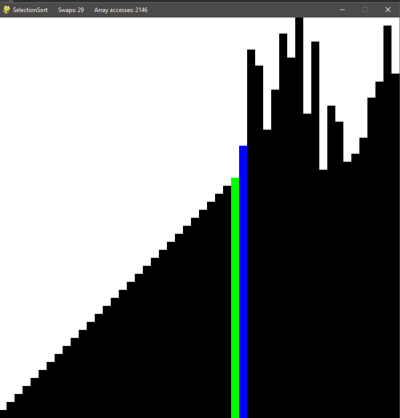

# Sorting-Visualizer-Tool

This sorting visualizer was built with Pygame, a python library that is used to process user input and visualize the sorting process.
 
   
<div id="top"></div>


[](https://opensource.org/licenses/MIT)


<!-- TABLE OF CONTENTS -->
<details>
  <summary>Table of Contents</summary>
  <ol>
    <li>
      <a href="#about-the-project">About The Project</a>
      <ul>
        <li><a href="#built-with">Built With</a></li>
      </ul>
    </li>
    <li>
      <a href="#getting-started">Getting Started</a>
      <ul>
        <li><a href="#prerequisites">Prerequisites</a></li>
        <li><a href="#installation">Installation</a></li>
      </ul>
    </li>
    <li><a href="#license">License</a></li>
    <li><a href="#contact">Contact</a></li>
  </ol>
</details>


<!-- ABOUT THE PROJECT -->
## About The Project

This python-based sorting visualizer can be used to compare, analyze and visualize different sorting algorithms.

It is possible to change between different algorithms, see how they work, and compare important features such as the number of array accesses or exchanges used in the sorting process.

This can be informative since the algorithms can be started on the same data.

<p align="right">(<a href="#top">back to top</a>)</p>

### Built With

* [Pygame](https://www.pygame.org/)

<p align="right">(<a href="#top">back to top</a>)</p>


<!-- GETTING STARTED -->
## Getting Started

To make use of this project, you need to have Python and Pygame installed.

If you have that already you can jump right over to the Installation section.

Otherwise, you can follow the Prerequisites to see how to install them.

### Prerequisites

For this project, you need to have Python installed. 

Just try to run the following command: 
```sh
 python --version
```
 If this runs successfully and we can get a python version, we are ready to go.
 Otherwise, refer to [https://www.python.org/](https://www.python.org/)
 
 The next step is to install Pygame.
 
 If you are unsure if you have installed Pygame already, you can run the following commands to test:
 ```sh
 python
 ```
 and then 
 ```sh
 import pygame
 ```
 If Pygame is installed you will receive a greeting in the command line, otherwise, just follow along.
 
 We will use PIP to install Pygame, a tool that is useful to install modules in Python.
 
 PIP comes with Python 3.4+ included, so we can use it right away.
 
 Run the following command to install pygame. 
 ```sh 
 pip install pygame
 ```
 Now you are ready to go.
 

### Installation

1. Clone the repo
   ```sh
   git clone https://github.com/fabian-kruse/sorting-visualizer
   ```
2. Run the file in the "src" folder
   ```sh
   visualizer.py
   ```
3. Follow the instructions in the terminal
<p align="right">(<a href="#top">back to top</a>)</p>


<!-- USAGE EXAMPLES -->
## Usage

When starting the project you get a small introduction to how the tool works in the command line.
After that you are being asked how many elements should be sorted, the tool should open after you entered a number.

In the tool, you can use the left and right keys to switch between algorithms, and if you press "r" you get a new random initialization of the elements.

If you hit the space bar the sorting process begins.

In the title bar, you can see the number of exchanges and the number of array accesses for this sorting process.
 
 <p align="center">
  
</p>
 
Enjoy!

<p align="right">(<a href="#top">back to top</a>)</p>


<!-- LICENSE -->
## License

Distributed under the MIT License. See `LICENSE.txt` for more information.

<p align="right">(<a href="#top">back to top</a>)</p>


<!-- CONTACT -->
## Contact

Fabian Kruse - fabian_kruse@gmx.de

Project Link: [https://github.com/fabian-kruse/sorting-visualizer](https://github.com/fabian-kruse/Sorting-Visualizer)

<p align="right">(<a href="#top">back to top</a>)</p>

© 2021 GitHub, Inc.
Terms
Privacy
Security
Status
Docs
Contact GitHub
Pricing
API
Training
Blog
About
